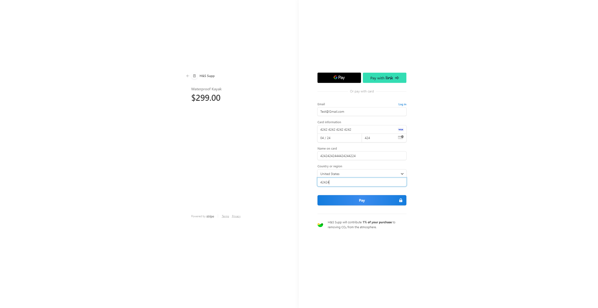

# Hide and Seek Supplies

## Table of Contents
- [Hide and Seek Supplies](#hide-and-seek-supplies)
  - [Table of Contents](#table-of-contents)
  - [Description](#description)
  - [Features](#features)
- [Technologies Used](#technologies-used)
  - [Installation](#installation)
  - [Usage](#usage)
  - [Screenshots](#screenshots)
    - [Top of Homepage](#top-of-homepage)
    - [Bottom of Homepage](#bottom-of-homepage)
    - [Featured Products](#featured-products)
    - [Out of Stock](#out-of-stock)
    - [Deals](#deals)
    - [Used Items](#used-items)
    - [H\&S Cart](#hs-cart)
    - [H\&S Multiple Items](#hs-multiple-items)
    - [H\&S Checkout using Stripe](#hs-checkout-using-stripe)
  - [Contributing](#contributing)
  - [License](#license)
  - [Links](#links)
  
## Description
This is an outdoor e-commerce platform designed to provide a seamless shopping experience for outdoor enthusiasts. It offers a wide range of products including camping gear, hiking equipment, apparel, and more.

## Features
```
User authentication and authorization
Browse products by categories
Search functionality with filters
Add products to cart and manage cart contents
Secure checkout process
Order history and tracking
Product reviews and ratings
Admin panel for managing products, categories, and users
```
# Technologies Used
```
* Apollo Server
* Express
* BCrypt
* DotENV
* GraphQl
* JsonWebToken
* Mongoose
* React
* React Router Dom
* Stripe
* React-Bootstrap
```
## Installation
To run this platform locally, follow these steps:
```
1. Git Clone the Repo
2. npm install
3. for server
  - npm run seed
  - npm run start
4. for client
  - npm run start
5. Open the app on your localhost
```

```
Visit the homepage at https://?????????????????????????????.herokuapp.com/
```

## Usage
1. Visit the homepage and explore the available products.
2. Create an account or log in if you already have one.
3. Add products to your cart and proceed to checkout.
4. View your order history in your user profile. (future implementation)

## Screenshots
### Top of Homepage

### Bottom of Homepage

### Featured Products

### Out of Stock

### Deals

### Used Items

### H&S Cart

### H&S Multiple Items

### H&S Checkout using Stripe


## Contributing
We welcome contributions from the community! If you find any bugs, have feature requests, or want to contribute code, please contact one of our collaborators!

Key collaborators:
- Hayden Felfe     <https://github.com/HaydenFelfe>
- Seung Hyuk Park  <https://github.com/sptres>
- Jonathan Pascual <https://github.com/JPascual007>
## License
[](https://opensource.org/licenses/mit)

## Links
[Application Link](https://secret-headland-44009-a7fef38932b2.herokuapp.com/)

[Github Repo](https://secret-headland-44009-a7fef38932b2.herokuapp.com/)